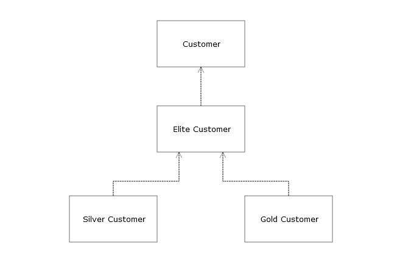

# Inheritance

## Key Terms

- Inheritance

- Virtual and Abstract

## Introduction

- Software engineering is not black and white, its a sea a gray
- Software is knowing what not to do
- Bad code comes from either not knowing, or not caring, you can't know everything, but you can eliminate the second
- Even though inheritance is a key pillar to object-oriented programming, we need to keep it to a minimum. The more inheritance we introduce in our system, the more issues we are inviting to happen.
- There is good and bad inheritance in software, the key is knowing how to minimize the bad while taking full advantage of the good

## Goals

After completing this chapter will you will be able to...

Understand how adding to already implemented classes can cause issues.

Recognize that inheriting from multiple classes is not recommended.

Distinguish between good and bad forms of inheritance.

Realize that giving clients unimplemented interfaces will produce frustration.

## Wisdom

> The function of good software is to make the complex appear to be simple. (Booch, 2010)

- Complexity in software is an unavoidable force. We need to reduce it however we can. The proper use of inheritance and abstraction is one way of doing so. Inheritance allows reuse. Abstraction removes details. Both can work together and compliment each other.

## Simple Success - Costco

Costco Wholesale is a big-box retail store that was founded in 1994 just outside of Seattle. While Costco sells thousands of items in their store and online, each item they sale typically has very few options available to choose from. If you want to buy ketchup or napkins from Costco, you typically have one name brand and possible a generic brand to choose from. This is intentional on Costco's part because human behavior has a tendency to succumb to analysis paralysis. When people are presented too many options to choose from, they end up not choosing any of them because they are overwhelmed with options. For Costco, this means a loss of possible sales if people aren't buying products from them. Limiting options to customers ends up helping Costco in two ways; it forces customers to buy products, and it helps move product faster, which cuts down on costs.

## Code

### The Problem with Multiple Implementations

#### Code Domain

- We will continue with our Reservation system. Our business requirements have changed to allow for a loyalty system that rewards frequent guests.
- The business wants a system that allow us to identify and reward elite customers with benefits for being a frequent customer.

---

:large_blue_circle: Constantly changing requirements are a reality in all businesses. Legal, leadership, and customer demands are constantly changing-and your software will have to adapt.

---

- Our domain has a new class to identify an elite customer. This class will contain base logic for all elite customer.
- Any special elite tiers will be a separate class to hold specific logic related to that elite tier.

**Figure 2-x** Elite customer classes

```csharp
public class EliteCustomer : Customer
{
    // Properties and methods for Elite customers

    public virtual decimal ApplyDiscount(decimal amount)
    {
        return amount * .90m;
    }
}
```

- Our first class will be an "EliteCustomer" that inherits from Customer so we get to enjoy the benefits of inheritance.
- This class contains logic related to all elite customers and will serve as a base class for all future elite tiers.

**Figure 2-x** Silver elite customer

```csharp
public class SilverCustomer : EliteCustomer
{
    // More overrides for Silver elites.

    public override decimal ApplyDiscount(decimal amount)
    {
        return amount * .85m;
    }
}
```

- Our first tier is for Silver elites. Currently Silver elites enjoy a larger discount that is accomplished by overriding the base method.

**Figure 2-x** Gold elite customer

```csharp
public class GoldCustomer : EliteCustomer
{
    // More overrides for Gold elites.

    public override decimal ApplyDiscount(decimal amount)
    {
        return amount * .80m;
    }
}
```

- Our highest tier is for Gold elites who enjoy the largest discount from their status.

#### Multiple Implementations require extra testing

- Having multiple implementations means that each class will require its own suite of unit tests.
- Since each of our classes is overriding the same method, there is a degree of duplication between the tests since we are testing the same functionality in each class.

**Figure 2-x** Unit tests for elite customers

```csharp
[TestClass]
public class EliteCustomerTests
{
    [TestMethod]
    public void ApplyDiscount_IsCorrect()
    {
        var customer = new EliteCustomer();

        var result = customer.ApplyDiscount(100m);

        Assert.AreEqual(90m, result);
    }
}
```

```csharp
[TestClass]
public class SilverCustomerTests
{
    [TestMethod]
    public void ApplyDiscount_IsCorrect()
    {
        var customer = new SilverCustomer();

        var result = customer.ApplyDiscount(100m);

        Assert.AreEqual(85m, result);
    }
}
```

```csharp
[TestClass]
public class GoldCustomerTests
{
    [TestMethod]
    public void ApplyDiscount_IsCorrect()
    {
        var customer = new GoldCustomer();

        var result = customer.ApplyDiscount(100m);

        Assert.AreEqual(80m, result);
    }
}
```

- Having to perform the same unit test for each class is tedious and is error prone when one is tempted to copy and paste code that is similar.

#### Changes in base classes cascade new behavior

- When a change is made in a base class that is a dependency for other classes down the line, it may warrant unwanted changes.
- One situation for this may be to only allow elite customers to only have X amount of discounts in a certain time frame.

**Figure 2-x** Elite customer with an updated method

```csharp
public class EliteCustomerUpdated : Customer
{
    // Properties and methods for Elite customers

    public virtual decimal ApplyDiscount(decimal amount, bool isEligible)
    {
        if (isEligible)
        {
            return amount * .90m;
        }

        return amount;
    }
}
```

- Our method to apply a discount has been updated to accept a boolean flag to signal a customer is eligible for a discount.

**Figure 2-x** Updated silver customer

```csharp
public class SilverCustomerUpdated : EliteCustomerUpdated
{
    public override decimal ApplyDiscount(decimal amount, bool isEligible)
    {
        if (isEligible)
        {
            return amount * .85m;
        }

        return amount;
    }
}
```

- And our Gold elite customer would be updated as so.

**Figure 2-x** Updated gold customer

```csharp
public class GoldCustomer : EliteCustomerUpdated
{
    // More overrides for Gold elites.

    public override decimal ApplyDiscount(decimal amount, bool isEligible)
    {
        if (isEligible)
        {
            return amount * .80m;
        }

        return amount;
    }
}
```

- Our Silver and Gold elite customers are updated as well to account for the method signature change in our base class.
- These changes may not seems like much, but we will have to update our unit tests as well.

**Figure 2-x** Our elite customer updated with new unit tests

```csharp
[TestClass]
public class EliteCustomerUpdatedTests
{
    [TestMethod]
    public void ApplyDiscount_Eligible_IsCorrect()
    {
        var customer = new EliteCustomerUpdated();

        var result = customer.ApplyDiscount(100m, true);

        Assert.AreEqual(90m, result);
    }

    [TestMethod]
    public void ApplyDiscount_InEligible_IsCorrect()
    {
        var customer = new EliteCustomerUpdated();

        var result = customer.ApplyDiscount(100m, false);

        Assert.AreEqual(100m, result);
    }
}
```

- We would still need to update **both** our silver and gold customer unit tests as well.
- It should be obvious that just by adding a single parameter to a base class has resulting in an exponential amount of changes that much occur downstream.

---

:x: Small changes that result in many changes downstream is commonly referred to as "Shotgun Surgery" due to a single source inflicting multiple wounds.

---

#### Changes in base classes may result in undefined behavior

- One side effect from the updated EliteCustomer may be undefined behavior that cascades into derived classes.
- What if our Gold elite customer had no cap on their discount eligibility?
- We still need to keep the flag for the other tiers, so the answer is to simply ignore it for gold customers.

**Figure 2-x** Gold elite customer can ignore eligibility

```csharp
public class GoldCanIgnoreEligibility : EliteCustomerUpdated
{
    // More overrides for Gold elites.

    public override decimal ApplyDiscount(decimal amount, bool isEligible)
    {
        return amount * .80m;
    }
}
```

- In this situation our "isEligible" parameter goes unused and is discarded by the method.
- Clients are unaware that this property is discarded and may result in undefined behavior if they try to pass in the value true for the flag.

**Figure 2-x** Updated unit tests with undefined behavior

```csharp
[TestClass]
public class GoldCanIgnoreEligibilityTests
{
    [TestMethod]
    public void ApplyDiscount_Eligible_IsCorrect()
    {
        var customer = new GoldCanIgnoreEligibility();

        var result = customer.ApplyDiscount(100m, true);

        Assert.AreEqual(80m, result);
    }

    [TestMethod]
    public void ApplyDiscount_InEligible_IsCorrect()
    {
        var customer = new GoldCanIgnoreEligibility();

        var result = customer.ApplyDiscount(100m, false);

        // This will fail even though we tell the method not to apply the discount.
        Assert.AreEqual(100m, result);
    }
}
```

- In our second test the method requires us to pass the eligibility flag which we have set the false. While we expect the assertion to be correct, it will fail since the flag is ignored by the method.

#### The Frustration with Testing Multiple Implementations

**Figure 2-x** Class dependency diagram for customers



- A UML class diagram shows how our classes hold dependencies to other classes. The root of the issue is that we have multiple levels of inheritance.
- When a change is made is Customer or EliteCustomer, any change must trickle down to all other classes that inherit from these base classes.

---

:heavy_check_mark: Inheritance is best when employed in a minimum dependency chain. The fewer levels, the easier you codebase can adapt to change.

---

- If we only had one level of inheritance, our code would be much easier to maintain and test.
- One level of inheritance would allow us to keep all common code in our Customer class, then override anything required in derived classes.

---

:warning: Inheritance is the second highest form of coupling after friendship. Stay vigilant against excessive inheritance as you are aware it _will_ cause problems.

---

- Language like C# and Java have made it easier to deal with inheritance by explicating now allowing you to employ multiple inheritance. Multiple inheritance suffers from the "triangle problem" where classes B and C inherit from A, but class D inherits from both B and C.

---

:x: C# still allows you to use multiple inheritance via interfaces. The triangle problem will still exist in a less punishing form.

---

#### Transforming X to Y

##### Step 1

##### Step 2

##### Step N

#### The Result of Y

#### The Ability to Test Y

### The Problem with Multiple Base Classes (liskov)

#### The Inability to Test X

:warning: Use abstract classes judiciously. Ideally you only touch an abstract class once. Having to update an abstract class is a potential sign refactoring is needed.

#### Transforming X to Y

##### Step 1

##### Step 2

##### Step N

#### The Result of Y

#### The Ability to Test Y

### The Problem with Unimplemented Interfaces (interface segregation)

- We saw a similar issue with an unused interface with our original gold customer class when it discarded the eligibility flag.

---

:warning: Interface segregation goes beyond ignoring a method signature. It applies to any property, field, or method parameter that goes unused.

---

#### The Inability to Test X

#### Transforming X to Y

##### Step 1

##### Step 2

##### Step N

#### The Result of Y

#### The Ability to Test Y

## Hard Truth

### Another form of wisdom

## Vocation

### Career Advice

## Automation

### Automate your processes

## Conclusion

### Simple paragraph that comes back to testing. Two sentences for summary, transition, go to next steps

:large_blue_circle: Software is about have the least amount of dependencies as possible. The fewer dependencies, the more our software can adapt and change at will.

---

:large_blue_circle: It's easy to confuse abstract and virtual. The key to remember is that virtual methods may be overridden, while abstract methods must be overridden.

---

> :large_blue_circle: We are using a switch expression which is a more compact type of switch statement. The logic is the same as a normal switch statement.

> :heavy_check_mark: Removing a constructor parameter has further encapsulated our class. Clients now have zero knowledge that our CustomerStatus enum exists.

- Breaking our Customer class into specific classes for each type of customer is an example of SRP. (Single Responsibility Principle) Each class is only responsible for dealing with a specific customer type.

> :warning: Don't fret about applying SRP everywhere. Like most things in software engineering, there's a place and time for everything.
