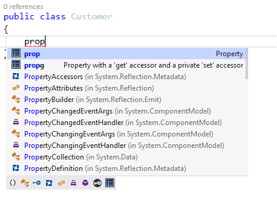
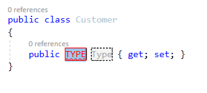
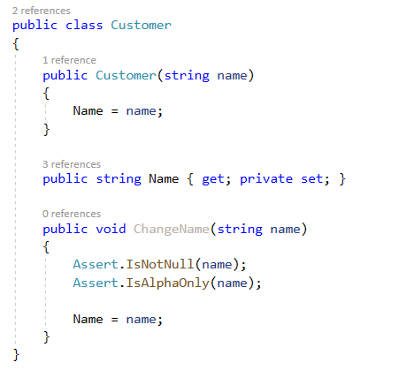

###### Chapter 3
## Code Building Blocks

**After completing this chapter you will be able to**

- Understand the purpose of encapsulation, inheritance, polymorphism, and abstraction
- Apply polymorphism to your advantage
- Understand how functional code can replace procedural code
- Know how to combine the best of object-oriented and functional code
- Use callbacks to their maximum potential

1. The purpose of object-oriented code
2. The purpose of functional code
3. OOP and Functional can live together in harmony

## Object-Oriented Programming

### Encapsulation

> "You're on a need-to-know basis, and you don't need to know." (Simpson, Bruckheimer, & Bay, 1996).

If you are not familiar with the term "need to know", it is typically used by organizations to describe a certain level of information that a person or entity is entitled to know about. A well-engineered application works the same way. Classes only give up the information and details that is necessary. The less internal knowledge available to other classes, the smaller the chance that data may end up in an invalid state.

---
**Info** :information_source:

Encapsulation goes beyond code, it extends into the architecture of your application as well. Your code maybe encapsulated correct, but your architecture can still leak details about its internals.

---

Common ways to encapsulate code:

1) Make fields private
2) Limit or eliminate public setters
3) Label classes as internal or private if possible

But *why* should I as a developer go through all the trouble to encapsulate my code?

Why would you use an object-oriented language then if you refuse to encapsulate your data? One of the reasons why object-oriented languages such as C# and Java became so popular is because with a single keyword we can make something disappear from the rest of our application.

For all the same reasons that your encapsulate your own personal data. What would happen if you allowed anyone to know your social security number, address, and mother's maiden name? Your identity could possibly be stolen and you would have to go through a great deal of trouble to correct any bad marks on your record. Software follows the same principles. Someone may use your code in a way that it was not intended to be used. There may not even be malicious intent involved. We should be on guard against any possible misuse of our data, both personally and in code.

As an engineer, our job is to solve problems. Not create new ones. Limiting the number of possibilities in our code is the best way to limit the misuse of said code. When there are fewer possible outcomes, we limit our liability and the chance that something bad or unintentional may happen. Encapsulation is one of the best forms of defensive programming because we are controlling what details we allow the outside world or outside classes to see.

---
**Correct** :heavy_check_mark:

Encapsulate your application as much as possible. Keep fields private until they have to public. Keep classes internal until they have to be public.

---

##### IDE Disadvantages

One of my biggest gripes with VisualStudio is the default way properties are implemented in the IDE. If you use the keyword *prop* to create a new property, it will automatically have a public getter and setter. You need to be wary that your fellow developers may not care as much as you do about enforcing encapsulation as much as you do.


**Figure 3-X** Using the "prop" keyword in VisualStudio to add a new property.


**Figure 3-X** Our new property after using the shortcut.

I have seen far to many classes in my career that had public setters that not only broke encapsulation, but were completely unnecessary in the first place. Many times these will occur in domain models and DTO's. As an engineer, it is your duty to instill a culture of encapsulation on your team.

---
**Correct** :heavy_check_mark:
Ideally you should have zero public setters in your application. Modifying a field should go through a method that performs validation before the field is changed.

---


**Figure 3-X** The class above displays a method that uses validation to protect against null or non-alpha characters being used in a name.

---
**Warning** :warning:

There are some classes in your application that need to public because it is required. A lot of these will fall under the *reflection* category where a framework just as an ORM or a JSON serialization library requires a public property in a class.

---


---
**Note** :memo:

Encapsulating data isn't just something for your end-users. The less other developers are privy to details about non mission critical code. The easier your application is to understand for everyone.

---

### Inheritance

### Polymorphism

### Abstraction

---
**Hint** :bulb:

If you easily confuse encapsulation and abstraction, remember that encapsulation is *explicit* and abstraction is *implicit*.

Encapsulation - "I'm not going to show you."
Abstraction - "I'm not going to show you how."

---


## Functional Programming

### Minimizing Procedural Code

### Unnecessary Arguments

A conversation that you will probably witness in your career is the argument of the object-oriented paradigm versus the functional paradigm. These conversations sometimes regress into holy wars akin to the hotly debated topic of "Tabs versus Spaces", bracket alignment, or other similar arguments in the industry. It is to your best interest to avoid this argument as object-oriented and functional are **not** mutually exclusive paradigms. You are not required to choose one over the other for your application. Each has its advantages and disadvantages and the task is yours to understand and apply each paradigm where you feel it is necessary.

#### Methods versus Classes

Object-oriented code is best suited in situations where you need a class, and functional code is best suited in situations where you only need a function. It is that easy. Because objects and functions are both first class citizens in most major programming languages it is unnecessary to anguish over any drawbacks that may occur when applying one or the other in our code.

Remember that classes contain _both_ properties and functions. From the first part in this chapter we discussed how the data contained in the properties of classes is both encapsulated and abstracted away from clients. This is done because we do not want our clients to be privy to the details of our classes and how they interact with private data.

Functions on the other hand are data agnostic. They will any input as long as what you are passing matches the type and number of parameters. The important idea to remember is that classes are contains functions that operate on a closed set of properties, where functions are open to any data you pass.

1. _Classes are closed._ They are best suited when you need to operate over an encapsulated data set.
2. _Functions are open._ They are best suited for generic use cases when you just need to pass data and get a result.

##### Masking an Id

Assuming that we had the use case that we needed a masked version of a Customer's id in our application we have a number of ways to implement a solution:

Lets look at a quick example that highlights our cause:

**Listing 12-X** A Customer class

```csharp
    public class Customer
    {
        public Customer(Guid id)
        {
            Id = id;
        }

        public Guid Id { get; }

        public string MaskedId()
        {
            const int startingIndex = 0;
            const int length = 8;

            return Id.ToString().Substring(startingIndex, length);
        }
    }
```

Our Customer class contains an id to designate its identity and a function that will return a masked version of the id that only contains the first eight alphanumeric characters.

**Listing 12-X** Customer class test

```csharp
    [TestClass]
    public class CustomerTests
    {
        [TestMethod]
        public void MaskId_ReturnsCorrectValue()
        {
            var id = Guid.Parse("4dd48f87-be33-4d31-bc2e-4888ef8aaaee");

            var customer = new Customer(id);

            Assert.AreEqual("4dd48f87", customer.MaskedId());
        }
    }
```

Our test insures that the string we return is correct.

This is opposed to say a functional form of what we just accomplished:

**Listing 12-X** A functional version of the IdMasker

```csharp
    public static class IdMasker
    {
        public static string MaskId(Guid id)
        {
            const int startingIndex = 0;
            const int length = 8;

            return id.ToString().Substring(startingIndex, length);
        }
    }
```

The MaskId function now exists independently.

> **Note:** In csharp all functions need to exist inside of a class. This is a language requirement. We have made the function static to avoid the instantiation of the class into order to use the function.

**Listing 12-X** Test for the IdMasker function

```csharp
    [TestClass]
    public class IdMaskerTests
    {
        [TestMethod]
        public void MaskId_Guid_ReturnsCorrectValue()
        {
            var id = Guid.Parse("4dd48f87-be33-4d31-bc2e-4888ef8aaaee");

            Assert.AreEqual("4dd48f87", IdMasker.MaskId(id));
        }
    }
```

Our test is identical to the Customer class test.

##### Understanding the difference

On the surface, masking the id inside a class versus masking a Guid in a static function bear little difference. They both do the same thing, however they accomplish it differently. In the class version, we are saying that the customer class is the only entity in our application that can mask the id, and it only operates on the internals of the class itself. Where the MaskId function will take any Guid we give it and return a masked version of the id. The class is specific in that only works on the individual id of the class, where the function is generic, it will operate on any Guid we give it.

We can show an even more pronounced example of this if we modify the customer class slightly to incorporate both the power of encapsulation and abstraction.

**Listing 12-X** Our customer class modified

```csharp
    public class ModifiedCustomer
    {
        private const int MaskedIdStartIndex = 0;
        private const int MaskedIdLength = 8;
        private Guid _id;

        public ModifiedCustomer(Guid id)
        {
            _id = id;
        }

        public string Id => _id.ToString().Substring(MaskedIdStartIndex, MaskedIdLength);
    }
```

Our id field is now fully private, and we have moved the MaskId function to the public property.

**Listing 12-X** Test for ModifiedCustomer

```csharp
    [TestClass]
    public class ModifiedCustomerTests
    {
        [TestMethod]
        public void Id_ReturnsCorrectValue()
        {
            var id = Guid.Parse("4dd48f87-be33-4d31-bc2e-4888ef8aaaee");

            var customer = new ModifiedCustomer(id);

            Assert.AreEqual("4dd48f87", customer.Id);
        }
    }
```

Our test is updated to just call the property instead of the method.

With the MaskId function attached the property, we have used both encapsulation (the Guid form of the id is now fully private) and abstraction (the client does not call the function explicitly, only implicitly) we have harnessed the power of the object-oriented paradigm. Our client is unable to access the details of the class and is not burdened by the knowledge of having to the call the MaskId function.

**Listing 12-X** MaskId function now accepts an object

```csharp
    public static string MaskId(object obj)
    {
        const int startingIndex = 0;
        const int length = 8;

        return obj.ToString().Substring(startingIndex, length);
    }
```

Our MaskId function has been changed to a generic version that will accept any object and will return a masked version. This allows it to work on other primitive types such as strings or integers.

**Listing 12-X** New test for generic MaskId function

```csharp
    [TestMethod]
    public void MaskId_Object_ReturnsCorrectValue()
    {
        const string id = "4dd48f87-be33-4d31-bc2e-4888ef8aaaee";

        Assert.AreEqual("4dd48f87", IdMasker.MaskId(id));
    } 
```

This version of our MaskId function has been pushed towards a far more generic version that allows us to pass any object as an argument and it will return a masked version. Our use case for this is that we want to be able to mask any type in our application. We started with the same use case of having to mask an Guid and implemented our solution inside a class and individually as a function. We modified the our solution so our class harnessed the power of object-oriented concepts such as abstraction and encapsulation to hide the details of the implementation from the client. We also modified our individual function to take advantage of the ability to call a function when needed and pass a generic argument. In the end we have accomplished the same thing, but have implemented our solution in two very different ways. The power of functions is full utilized when you require global I/O that is generic in nature. The power of classes is full utilized when you require confined I/O that works with a constrained data set.

### Harnessing Callbacks

## Code Building Blocks Conclusion
