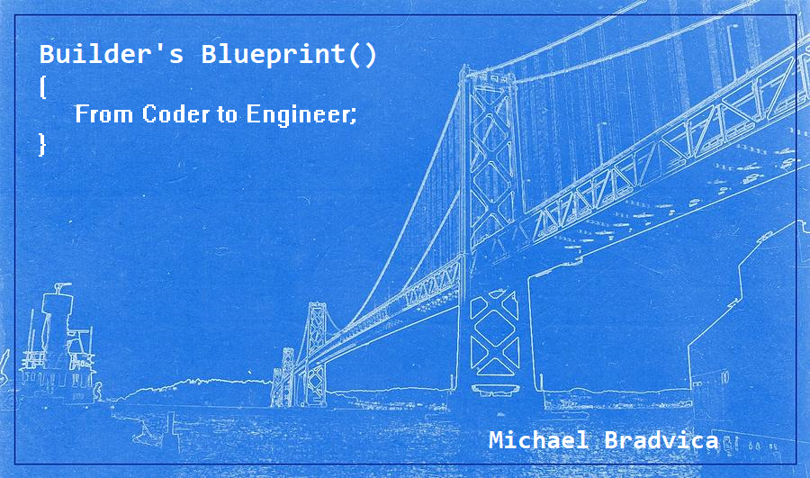

# Contents at a glance

1. Encapsulation
   1. Public setters
   2. Private methods
   3. Naked properties
2. Inheritance
   1. Adding to Implementations - Virtual and abstract
   2. Bad Base Classes - Liskov (pre/post-conditions/invariants, use interfaces)
   3. Unimplemented Interfaces - Segregate Interfaces
3. Coupling
   1. "new" keyword - Factory, Factory method
   2. Static - Bad vs Good, Loggers everywhere
   3. Friendship/Internal
4. Polymorphism
   1. Bad Dependencies - Dependency Injection
   2. Relying on implementations - Dependency Inversion (DateTime, HttpClient, DbContext, SqlConnection, Loggers)
   3. Small Variations - Generics & Constraints
5. Abstraction
   1. Logic in the wrong place - everything data fetch/Validation/logic in app
   2. Excessive parameters - Command
   3. Excessive dependencies - Chain of Responsibility
6. Responsibility
   1. God classes - Observer (just send the event, push into domain in ch. 8)
   2. Complex creations - Builder
   3. Complex procedural code - Strategy
7. Common Interfaces
   1. Responses - Envelope (null is a bad abstraction)
   2. Services - Mediator
   3. Similar Queries - Query Object
8. Repetition
   1. Repetition in the presentation layer - Common Interface
   2. Repetition in the application layer - Common Interface (base handlers, base chains, domain services, events to repo/aggregate root)
   3. Repetition in the data layer - Common Interface

## Quotes

"Brevity is the soul of wit."

"Everything should as simple as possible, but not simpler."

"The enemy of perfection is good enough."

## Working Title

Builder's Blueprint:

From Code to Software - Golden Gate
From Code to Components - Brooklyn
From Code to Patterns - Tower
From Code to Architecture - Pont du Gard
From Code to Clouds - Coronado/Sunshine Skyway

## Horror Stories

"Can't tell you the last time we deployed to production."

Emphasize moving from code to software

Tests are insurance. Your code gets so bad that an insurance company refuses to cover you.
Your code is so bad that writing and maintaining tests is almost impossible.
